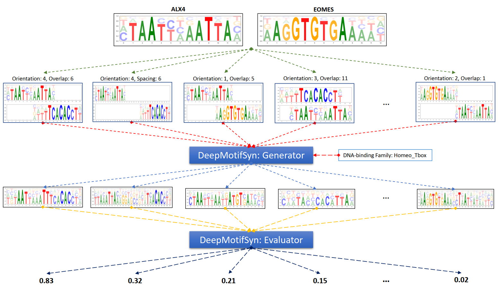

# DeepMotifSyn: a deep learning approach to synthesize heterodimeric DNA motifs

## Introduction
DeepMotiSyn is a deep-learning-based model to synthesize heterodimeric motifs from monomeric motif pairs. 
 
This model consists of heterodimeric motif generator and evaluator. The generator is a U-Net-based neural network that down-convolutes a monomeric motif pair and then up-convolute to generate a heterodimeric motif. A downstream machine learning model is used as the evaluator to compute for the predicted probability that a generated heterodimeric motif is the true one, based on the motif sequence features and DNA-binding family. Together, the generator and evaluator provide an integrated tool that enables users to conveniently synthesize heterodimeric motifs using any motif pair of interests.

 
## Requirement
* python == 3.7
* pytorch == 1.7
* xgboost == 1.3.3
* MATLAB Engine API

Here is a tutoral how to install MATLAB Engine API

https://www.mathworks.com/help/matlab/matlab_external/install-the-matlab-engine-for-python.html

## Usage

Here is a [synthesis example notebook](https://colab.research.google.com/github/JasonLinjc/deepMotifSyn/blob/main/FLI1_FOXI1_synthesis_example.ipynb) which can be run on colab: 

## CONTAINS:
* notebook/cross_validation_DeepMotifSyn.ipynb: Python notebook to evaluate DeepMotifSyn under leave-one-motif-pair-out cross-validation
* notebook/deepMotifSyn_motifSynthesis.ipynb: Python notebook to run DeepMotifSyn on synthesizing **FLI1-FOXI1** motif
* data/*: Dataset for training and evaluating DeepMotifSyn containing 614 [CAP-SELEX](https://www.nature.com/articles/nature15518) heterodimeric motifs from 313 monomeric motif pairs
* reproduced_paper_figure/plot_paper_figure.ipynb: Python notebook to plot the figures in our manuscript
* model/*: A well-trained DeepMotifSyn model containing a U-Net-based generator and a XGBoost-based evaluator
